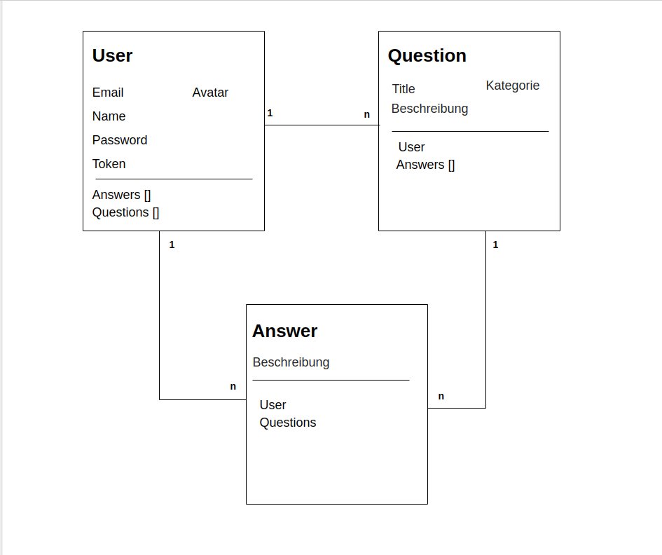

# devq-mini-project

## Features


- **Login**: Der User kann über eine Anmelde-Maske sich in seinen Account einloggen
- **Register**: Der User kann sich einen Account erstellen und meldet sich damit automatisch an
- **Logout**: Der User kann sich aus seinem Account wieder ausloggen
- **Question erstellen**: Der User kann über ein Formular Title und Description (und Kategorie) angeben. Diese Question wird dann in einer Datenbank gespeichert.
- **Questions**: Es können Fragen erstellt werden. Diese werden auf dem Server mit mongodb gespeichert. Der User kann eine Liste von Fragen sehen. Er kann eine Detailansicht der Frage sehen wo mehr als nur der Titel enthalten ist
- **Answer**: Der User kann über ein Eingabeformular eine Antwort für eine Answer erstellen. Diese Antwort wird in der UI auf der Question-Page dargestellt und in der Datenbank gespeichert.

### Optional Features - 1


- **Account-Update**: Der User kann seine persönlichen Daten ändern (Name & Avatar)
- **Kategorie-Filter**: Es gibt eine feste Liste von Kategorien. Der User kann diese Kategorien als Filter für die Question-Liste verwenden. Die Kategorie wird bei der Erstellung einer Question definiert.


### Optional Features - 2

- **Pagination**: Die Liste der Fragen ist auf 5 Fragen begrenzt. Es gibt einen button welcher die nächsten 5 Fragen nachladen kann
- **User-Question-List**: Der User kann im Account-Bereich eine Liste seiner eigenen Fragen sehen
- **User-Answer-List**: Der User kann im Account-Bereich eine Liste seiner Antworten (zu Fragen) sehen
- **Avatar**: Der User kann beim Erstellen des Accounts einen Avatar hochladen.dieser wird bei den Antworten des Users (Question-Page) dargestellt
- **Such-Funktion**: Der User kann nach einem Search-Term über die Question-Liste filtern


## Models



- **User**: Managed User-Daten
- **Question**:
- **Answer**:


## Endpukte

### GET /questions

Liefert eine Liste aller questions zurück

Shape:
```javascript
{
  id: "djewhfjewhfkwrö",  
  title:"was kann XY tun?",
  description: "...",
  user: {
      email: 'my@mail.de',
      name: 'Hans Müller'
  },
  answers: [
      {
          description: '...'
      }
  ]
}

```

### GET /questions/[:id]

liefert uns eine einzelne Question zurück

Response:
```javascript
{
  title:"was kann XY tun?",
  description: "...",
  user: {
      email: 'my@mail.de',
      name: 'Hans Müller'
  },
  answers: [
      {
          description: '...'
      }
  ]
}
```

### POST /questions

erstellt eine neue question

Body:
```javascript
{
    title: "Was kann XY tun?",
    description: "...",
    user: "userid"
}
```

Response:
```javascript
{
  id: "djewhfjewhfkwrö",  
  title:"was kann XY tun?",
  description: "...",
  user: "sdefweklfk",
  answers: []
}
```

### POST /answers

erstellt eine antwort für eine question

Body:
```javascript
{
    description: "...",
    user: "sdefweklfk",
    question: "djewhfjewhfkwrö"
}
```

Response:
```javascript
{
    id: "flkjwkgrjeö",
    description: "...",
    user: "rkerökgetölhg",
    question: "ekjfkrjglrrö",
}
```

### POST /user/login

logged user ein

Body:
```javascript
{
    email: "my@mail.de",
    password: "1234"
}
```

Response:
```javascript
{
    id: "flkjrgrölgreg",
    email: "my@mail.de",
    name: "Hans Müller",
    answer: [],
    questions: [
        "jlklknlkwlwqö"
    ]
}
```

### POST /user/register

erstellt einen neuen user und loggt ihn ein

Body:
```javascript
{
    email: "my@mail.de"},
    password: "12345",
    name: "Hans Müller"
```

Response:
```javascript
{
    id: "efkjgförkgölrgm",
    email: "my@mail.de",
    name: "Hans Müller",
    answer: [],
    questions: []
}
```

### POST /user/logout

der usertoken cookie wird gelöscht. der token wird aus der datenbank entfernt

Body:
```javascript
{}
```

Response:
```javascript
true
```


### GET /user

gibt den aktuellen User zurück

Response:
```javascript
{
  id: "hbgkhbkbghh",
  email: "my@mail.de",
  name: "Hans Müller",
}
```


